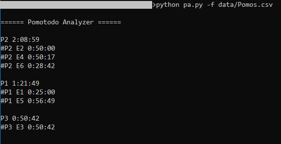

# Pomotodo Analyzer

## Usage

```
usage: pa.py [-h] [-f FILE] [-s {time,time_asc,title}]

Pomotodo time entry analyzer.

optional arguments:
  -h, --help            show this help message and exit
  -f FILE, --file FILE  Pomotodo time entry file
  -s {time,time_asc,title}, --sort {time,time_asc,title}
                        Project sort type (default: time)
```

## Screenshot


